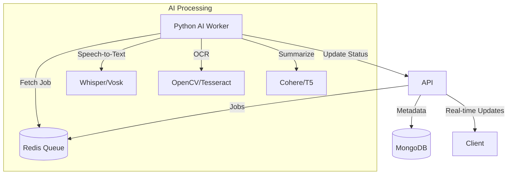

# 📘 Smart Lecture Lens

**Learn Smarter from Your Classrooms using AI**

Smart Lecture Lens is an AI-powered educational platform that transforms traditional lecture videos into interactive learning resources. By leveraging advanced NLP and computer vision, it automatically generates structured summaries, bilingual transcripts, and intelligent quizzes, enabling students to revise efficiently and educators to track learning outcomes.


---

## 🚀 Key Features

- **📂 Multi-Format Upload**: Support for video, audio, and YouTube links via AWS S3.
- **🗣️ Bilingual Transcription**: High-accuracy speech-to-text in **English** and **Hindi** using OpenAI Whisper/Vosk.
- **📝 AI-Powered Summaries**: Concise, context-aware summaries generated by **Cohere / T5 Transformers**.
- **🖼️ Optical Character Recognition (OCR)**: Extracts text from lecture slides and whiteboard writings.
- **❓ Intelligent Quizzes**: Auto-generates self-assessment quizzes from lecture content.
- **📊 Real-Time Analytics**: Monitor processing status and student performance via WebSockets and interactive dashboards.
- **⚡ Asynchronous Processing**: Scalable background job handling with **Redis** and **Celery/BullMQ**.

---

## 🛠️ Tech Stack

### **Frontend**
- **Framework**: [Next.js 15](https://nextjs.org/) (React)
- **Styling**: Tailwind CSS, Radix UI
- **State Management**: Zustand
- **Real-time**: Socket.io Client

### **Backend**
- **Runtime**: Node.js, Express.js
- **Database**: MongoDB (Data), Redis (Queue/Cache)
- **Queue**: BullMQ

### **AI Microservice**
- **Runtime**: Python 3.8+ (FastAPI)
- **ML/AI**: PyTorch, Transformers (Hugging Face), OpenCV, Pytesseract, Vosk

### **DevOps & Infrastructure**
- **Containerization**: Docker, Docker Compose
- **Storage**: AWS S3

---

## 🏗️ System Architecture



---

## 🚀 Getting Started

Follow these instructions to set up the project locally.

### Prerequisites
- **Node.js**: v18+
- **Python**: v3.8+
- **Docker & Docker Compose**
- **FFmpeg** (Required for audio processing)

### 1. Clone the Repository
```bash
git clone <repository-url>
cd Ai_Lecture_lens
```

### 2. Start Infrastructure (Database & Queue)
Use Docker to spin up MongoDB and Redis:
```bash
cd smart-lecture-ai-backend
docker-compose up -d redis
# If you have a mongo container in docker-compose, start it too, otherwise ensure local MongoDB is running.
```

### 3. Backend Setup (Node.js)
```bash
cd smart-lecture-ai-backend/backend

# Install dependencies
npm install

# Configure Environment
cp .env.example .env
# Update .env with your specific keys (AWS, COHERE_API_KEY, MONGO_URI, REDIS_URL)

# Start Server
npm run dev

# Start Worker (in a separate terminal)
npm run worker
```

### 4. AI Service Setup (Python)
```bash
cd smart-lecture-ai-backend/python-ai

# Create virtual environment (Optional but recommended)
python -m venv venv
# Windows
venv\Scripts\activate
# Linux/Mac
source venv/bin/activate

# Install dependencies
pip install -r requirements.txt

# Start FastAPI Server
uvicorn main:app --reload --port 8000
```

### 5. Frontend Setup (Next.js)
```bash
cd ../../  # Navigate back to root/Ai_Lecture_lens

# Install dependencies
npm install

# Configure Environment
# Create .env.local and add:
# NEXT_PUBLIC_API_URL=http://localhost:5000/api
# NEXT_PUBLIC_WS_URL=http://localhost:5000

# Start Application
npm run dev
```
Visit `http://localhost:3000` to view the application.

---

## 📄 API Reference

### Upload Lecture
`POST /api/lectures/upload`
- **Body**: `multipart/form-data` (video file, title)
- **Response**: `201 Created`

### Get Lecture Status
`GET /api/lectures/:id/status`
- **Response**: `{ status: "processing", step: "transcribing", progress: 45 }`

### Real-time Events (Socket.io)
- Event: `status_update` - Receives live progress updates for the active lecture.

---

## 🤝 Contributing
1. Fork the repository
2. Create your feature branch (`git checkout -b feature/AmazingFeature`)
3. Commit your changes (`git commit -m 'Add some AmazingFeature'`)
4. Push to the branch (`git push origin feature/AmazingFeature`)
5. Open a Pull Request

## 📄 License
Distributed under the MIT License. See `LICENSE` for more information.
Project_Report-[M_Project_Report.pdf](https://github.com/user-attachments/files/25138544/M_Project_Report.pdf)

Designe_Thinking on this Project-[Smart Lecture AI-Lens-ppt.pdf](https://github.com/user-attachments/files/25138632/Smart.Lecture.AI-Lens-ppt.pdf)

## 📸 Screenshots

### 🏠 Landing & Features
<p align="center">
    
    
    
</p>

### 🔐 Authentication
<p align="center">
  
  
</p>

### 📊 Dashboard & Lectures
<p align="center">
  
</p>

### 🧠 Quiz Flow
<p align="center">
  
  
</p>

### 📈 Analytics & Progress
<p align="center">
  
  
</p>

### 👤 Profile
<p align="center">
   
</p>
